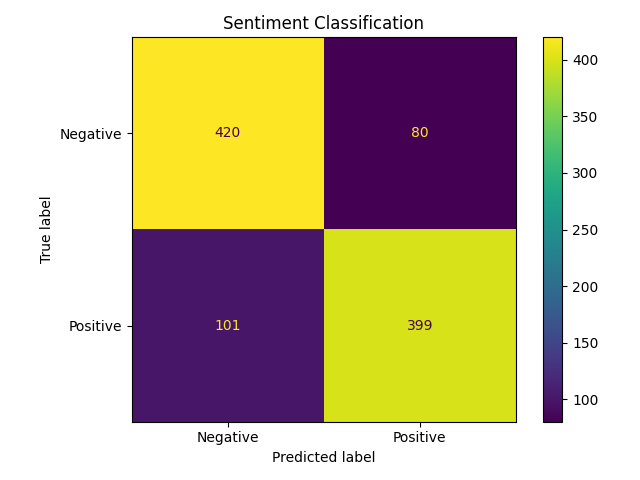

# Transformer Sentiment Classification

In this project, I used a pretrained Transformer model to classify IMDb movie reviews as either positive or negative.

I used **DistilBERT** with PyTorch and Hugging Face Transformers. The main goal was to apply Transformer concepts such as tokenization, attention masks, pretrained models, and transfer learning to a real text classification problem.

## Dataset

The dataset is the IMDb movie review dataset available through Hugging Face.

The original dataset contains:

- 25,000 training reviews
- 25,000 test reviews
- `0` = Negative
- `1` = Positive

Since I trained the model on CPU, I used a smaller sample for this project:

- 2,400 training reviews
- 600 validation reviews
- 1,000 test reviews

I used stratified splitting to keep the number of positive and negative reviews balanced across the datasets.

## Model

I used the pretrained **DistilBERT (`distilbert-base-uncased`)** model.

For this project, I kept the pretrained DistilBERT layers frozen and trained the classification layers for sentiment prediction.

The basic process is:

```text
Movie Review
     ↓
Tokenizer
     ↓
Token IDs + Attention Mask
     ↓
DistilBERT
     ↓
Classification Layer
     ↓
Positive / Negative
```

## Tokenization

Before training, each review is converted into tokens using the DistilBERT tokenizer.

I initially experimented with shorter sequence lengths (128 and 256), but many IMDb reviews were longer than those limits. Based on the review-length distribution, I used a maximum length of **512 tokens**. 

Reviews longer than 512 tokens are truncated, while shorter reviews are dynamically padded within each batch.

## Training

The main training settings were:

| Parameter | Value |
|---|---|
| Model | DistilBERT |
| Batch Size | 16 |
| Learning Rate | 0.0001 |
| Epochs | 3 |
| Maximum Length | 512 tokens |
| Model Selection | Validation Accuracy |
| Device | CPU |

The best model checkpoint was selected based on validation accuracy.

The best validation accuracy was approximately **86.8%**.

## Results

The final model was evaluated on 1,000 test reviews.

| Metric | Score |
|---|---:|
| Accuracy | **0.819** |
| Precision | **0.833** |
| Recall | **0.798** |
| F1 Score | **0.815** |

The model correctly classified **819 out of 1,000 test reviews**.

## Confusion Matrix

| | Predicted Negative | Predicted Positive |
|---|---:|---:|
| Actual Negative | 420 | 80 |
| Actual Positive | 101 | 399 |



## Tools

- Python
- PyTorch
- Hugging Face Transformers
- Hugging Face Datasets
- scikit-learn
- pandas
- NumPy
- Matplotlib
- Jupyter Notebook

## Repository Files

The trained model checkpoints are not included in the repository because of their large file size.

## Possible Next Steps

There are a few ways I could extend this project in the future:

- Fine-tune the full DistilBERT model instead of keeping the pretrained layers frozen
- Train on a larger portion of the IMDb dataset
- Compare the Transformer model with a traditional NLP model such as TF-IDF + Logistic Regression
- Look more closely at the reviews that the model classified incorrectly

## Author

**Saman Teymoorian**